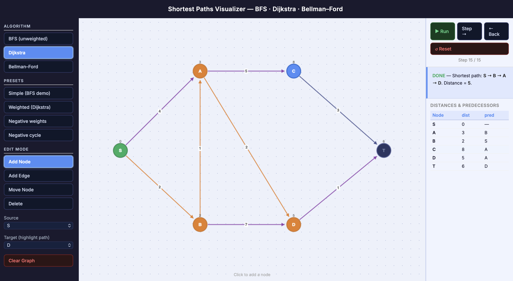

# Shortest Path Visualizer

An interactive browser-based tool for visualizing and understanding shortest path algorithms — built entirely with vanilla HTML, CSS, and JavaScript. No frameworks, no dependencies, no installation.

## Algorithms

| Algorithm | Use Case |
|-----------|----------|
| **BFS** | Unweighted graphs — finds shortest path by number of edges |
| **Dijkstra's** | Weighted graphs with non-negative edges — greedy, priority-queue based |
| **Bellman–Ford** | Handles negative edge weights and detects negative cycles |

## Features

- **Step-by-step playback** — step forward, step back, or auto-play at any speed
- **Live distance table** — watch `dist[]` and `pred[]` update in real time as the algorithm runs
- **Full graph editor** — add nodes, connect edges, set weights, move nodes, delete anything
- **Directed & undirected edges** — toggle per edge when building your graph
- **4 preset graphs** — including a negative weight graph where Dijkstra fails and Bellman–Ford succeeds, and a negative cycle detection demo
- **Shortest path highlight** — select a target node to trace the final path at the end
- **Color-coded canvas** — each node state (source, active, frontier, visited, path, negative cycle) has a distinct color

## How to Run

No installation needed. Download the file and open it in any browser:

open shortest_paths.html

Or just double-click the file in Finder.

## Built With

- Vanilla JavaScript (no libraries)
- HTML5 Canvas for graph rendering
- CSS3 for layout and styling